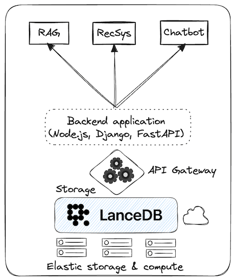

# What is LanceDB Cloud?

LanceDB Cloud is a fully managed SaaS (software-as-a-service) solution that provides a serverless vector database in the cloud. It separates storage from compute, enabling highly scalable vector search capabilities without the operational overhead. LanceDB Cloud is currently in private beta, with general availability coming soon.

[Try out LanceDB Cloud (Public Beta)](https://cloud.lancedb.com){ .md-button .md-button--primary }

## Key Features

- **Serverless Architecture**: Pay only for what you use, with automatic scaling
- **Managed Infrastructure**: No need to maintain servers or databases
- **High Performance**: Built on the same fast vector store as LanceDB OSS
- **Seamless Integration**: Compatible with existing LanceDB applications
- **Enterprise Security**: Built-in security features and compliance controls

## Architecture

LanceDB Cloud leverages the same powerful vector store engine as the OSS version but removes the infrastructure management burden. The serverless architecture means you only pay for the storage you use, while compute resources scale automatically based on your workload.



## Pricing

LanceDB Cloud offers a transparent, usage-based pricing model:
- Pay only for the storage you use
- Compute resources scale automatically
- No upfront costs or minimum commitments
- Free tier available for development and testing

## Getting Started

1. Sign up for the private beta
2. Create your first project
3. Connect using the LanceDB client library
4. Start building your vector search applications

## Transitioning from OSS to Cloud

The transition from LanceDB OSS to LanceDB Cloud is designed to be seamless:

1. **Development**: Start with LanceDB OSS for local development and testing
2. **Production**: Switch to LanceDB Cloud by updating your connection string
3. **No Code Changes**: Your existing code will work without modifications
4. **Data Migration**: Tools available to migrate your existing data

### Example Connection

```python
# OSS Connection
import lancedb
db = lancedb.connect("./data")

# Cloud Connection
db = lancedb.connect("lancedb://your-project-id")
```

## Support and Resources

- Documentation
- Community Support
- Enterprise Support (coming soon)
- API Reference
- Example Applications

For more information or to request early access, please contact our team.
