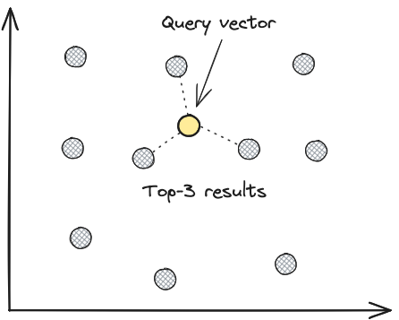

# Vector search

Vector search is a technique used to search for similar items based on their vector representations, called embeddings. It is also known as similarity search, nearest neighbor search, or approximate nearest neighbor search.

Raw data (e.g. text, images, audio, etc.) is converted into embeddings via an embedding model, which are then stored in a vector database like LanceDB. To perform similarity search at scale, an index is created on the stored embeddings, which can then used to perform fast lookups.

### Vector Database basics

A vector database is a database optimized for vector similarity search.


## Embeddings

Modern machine learning models can be trained to convert raw data into embeddings, represented as arrays (or vectors) of floating point numbers of fixed dimensionality. What makes embeddings useful in practice is that the position of an embedding in vector space captures some of the semantics of the data, depending on the type of model and how it was trained. Points that are close to each other in vector space are considered similar (or appear in similar contexts), and points that are far away are considered dissimilar.

Large datasets of multi-modal data (text, audio, images, etc.) can be converted into embeddings with the appropriate model. Projecting the vectors' principal components in 2D space results in groups of vectors that represent similar concepts clustering together, as shown below.

### Embedding Basics

An embedding is a vector (list of numbers) that represents the data in a way that captures its meaning.


## Indexes

Embeddings for a given dataset are made searchable via an **index**. The index is constructed by using data structures that store the embeddings such that it's very efficient to perform scans and lookups on them. A key distinguishing feature of LanceDB is it uses a disk-based index: IVF-PQ, which is a variant of the Inverted File Index (IVF) that uses Product Quantization (PQ) to compress the embeddings.

See the [indexing](index.md) page for more details on how it works.

## Brute force search

The simplest way to perform vector search is to perform a brute force search, without an index, where the distance between the query vector and all the vectors in the database are computed, with the top-k closest vectors returned. This is equivalent to a k-nearest neighbours (kNN) search in vector space.

### KNN Search

K-Nearest Neighbors (KNN) search is a technique for finding the K most similar items to a query item.



As you can imagine, the brute force approach is not scalable for datasets larger than a few hundred thousand vectors, as the latency of the search grows linearly with the size of the dataset. This is where approximate nearest neighbour (ANN) algorithms come in.

## Approximate nearest neighbour (ANN) search

Instead of performing an exhaustive search on the entire database for each and every query, approximate nearest neighbour (ANN) algorithms use an index to narrow down the search space, which significantly reduces query latency. The trade-off is that the results are not guaranteed to be the true nearest neighbors of the query, but are usually "good enough" for most use cases.


# Full-text search (Native FTS)

LanceDB provides support for full-text search via Lance, allowing you to incorporate keyword-based search (based on BM25) in your retrieval solutions.

!!! note
    The Python SDK uses tantivy-based FTS by default, need to pass `use_tantivy=False` to use native FTS.

## Example

Consider that we have a LanceDB table named `my_table`, whose string column `text` we want to index and query via keyword search, the FTS index must be created before you can search via keywords.

=== "Python"
    === "Sync API"

        ```python
        --8<-- "python/python/tests/docs/test_search.py:import-lancedb"
        --8<-- "python/python/tests/docs/test_search.py:import-lancedb-fts"
        --8<-- "python/python/tests/docs/test_search.py:basic_fts"
        ```
    === "Async API"

        ```python
        --8<-- "python/python/tests/docs/test_search.py:import-lancedb"
        --8<-- "python/python/tests/docs/test_search.py:import-lancedb-fts"
        --8<-- "python/python/tests/docs/test_search.py:basic_fts_async"
        ```

=== "TypeScript"

    ```typescript
    import * as lancedb from "@lancedb/lancedb";
    const uri = "data/sample-lancedb"
    const db = await lancedb.connect(uri);

    const data = [
    { vector: [3.1, 4.1], text: "Frodo was a happy puppy" },
    { vector: [5.9, 26.5], text: "There are several kittens playing" },
    ];
    const tbl = await db.createTable("my_table", data, { mode: "overwrite" });
    await tbl.createIndex("text", {
        config: lancedb.Index.fts(),
    });

    await tbl
        .search("puppy", "fts")
        .select(["text"])
        .limit(10)
        .toArray();
    ```

=== "Rust"

    ```rust
    let uri = "data/sample-lancedb";
    let db = connect(uri).execute().await?;
    let initial_data: Box<dyn RecordBatchReader + Send> = create_some_records()?;
    let tbl = db
        .create_table("my_table", initial_data)
        .execute()
        .await?;
    tbl
        .create_index(&["text"], Index::FTS(FtsIndexBuilder::default()))
        .execute()
        .await?;

    tbl
        .query()
        .full_text_search(FullTextSearchQuery::new("puppy".to_owned()))
        .select(lancedb::query::Select::Columns(vec!["text".to_owned()]))
        .limit(10)
        .execute()
        .await?;
    ```

It would search on all indexed columns by default, so it's useful when there are multiple indexed columns.

Passing `fts_columns="text"` if you want to specify the columns to search.

!!! note
    LanceDB automatically searches on the existing FTS index if the input to the search is of type `str`. If you provide a vector as input, LanceDB will search the ANN index instead.

## Tokenization
By default the text is tokenized by splitting on punctuation and whitespaces, and would filter out words that are with length greater than 40, and lowercase all words.

Stemming is useful for improving search results by reducing words to their root form, e.g. "running" to "run". LanceDB supports stemming for multiple languages, you can specify the tokenizer name to enable stemming by the pattern `tokenizer_name="{language_code}_stem"`, e.g. `en_stem` for English.

For example, to enable stemming for English:
=== "Sync API"

    ```python
    --8<-- "python/python/tests/docs/test_search.py:fts_config_stem"
    ```
=== "Async API"

    ```python
    --8<-- "python/python/tests/docs/test_search.py:fts_config_stem_async"
    ```

the following [languages](https://docs.rs/tantivy/latest/tantivy/tokenizer/enum.Language.html) are currently supported.

The tokenizer is customizable, you can specify how the tokenizer splits the text, and how it filters out words, etc.

For example, for language with accents, you can specify the tokenizer to use `ascii_folding` to remove accents, e.g. 'é' to 'e':
=== "Sync API"

    ```python
    --8<-- "python/python/tests/docs/test_search.py:fts_config_folding"
    ```
=== "Async API"

    ```python
    --8<-- "python/python/tests/docs/test_search.py:fts_config_folding_async"
    ```

## Filtering

LanceDB full text search supports to filter the search results by a condition, both pre-filtering and post-filtering are supported.

This can be invoked via the familiar `where` syntax.
 
With pre-filtering:
=== "Python"

    === "Sync API"

        ```python
        --8<-- "python/python/tests/docs/test_search.py:fts_prefiltering"
        ```
    === "Async API"

        ```python
        --8<-- "python/python/tests/docs/test_search.py:fts_prefiltering_async"
        ```

=== "TypeScript"

    ```typescript
    await tbl
    .search("puppy")
    .select(["id", "doc"])
    .limit(10)
    .where("meta='foo'")
    .prefilter(true)
    .toArray();
    ```

=== "Rust"

    ```rust
    table
        .query()
        .full_text_search(FullTextSearchQuery::new("puppy".to_owned()))
        .select(lancedb::query::Select::Columns(vec!["doc".to_owned()]))
        .limit(10)
        .only_if("meta='foo'")
        .execute()
        .await?;
    ```

With post-filtering:
=== "Python"

    === "Sync API"

        ```python
        --8<-- "python/python/tests/docs/test_search.py:fts_postfiltering"
        ```
    === "Async API"

        ```python
        --8<-- "python/python/tests/docs/test_search.py:fts_postfiltering_async"
        ```

=== "TypeScript"

    ```typescript
    await tbl
    .search("apple")
    .select(["id", "doc"])
    .limit(10)
    .where("meta='foo'")
    .prefilter(false)
    .toArray();
    ```

=== "Rust"

    ```rust
    table
        .query()
        .full_text_search(FullTextSearchQuery::new(words[0].to_owned()))
        .select(lancedb::query::Select::Columns(vec!["doc".to_owned()]))
        .postfilter()
        .limit(10)
        .only_if("meta='foo'")
        .execute()
        .await?;
    ```

## Phrase queries vs. terms queries

!!! warning "Warn"
    Lance-based FTS doesn't support queries using boolean operators `OR`, `AND`.

For full-text search you can specify either a **phrase** query like `"the old man and the sea"`,
or a **terms** search query like `old man sea`. For more details on the terms
query syntax, see Tantivy's [query parser rules](https://docs.rs/tantivy/latest/tantivy/query/struct.QueryParser.html).

To search for a phrase, the index must be created with `with_position=True`:
=== "Sync API"

    ```python
    --8<-- "python/python/tests/docs/test_search.py:fts_with_position"
    ```
=== "Async API"

    ```python
    --8<-- "python/python/tests/docs/test_search.py:fts_with_position_async"
    ```
This will allow you to search for phrases, but it will also significantly increase the index size and indexing time.


## Incremental indexing

LanceDB supports incremental indexing, which means you can add new records to the table without reindexing the entire table.

This can make the query more efficient, especially when the table is large and the new records are relatively small.

=== "Python"

    === "Sync API"

        ```python
        --8<-- "python/python/tests/docs/test_search.py:fts_incremental_index"
        ```
    === "Async API"

        ```python
        --8<-- "python/python/tests/docs/test_search.py:fts_incremental_index_async"
        ```

=== "TypeScript"

    ```typescript
    await tbl.add([{ vector: [3.1, 4.1], text: "Frodo was a happy puppy" }]);
    await tbl.optimize();
    ```

=== "Rust"

    ```rust
    let more_data: Box<dyn RecordBatchReader + Send> = create_some_records()?;
    tbl.add(more_data).execute().await?;
    tbl.optimize(OptimizeAction::All).execute().await?;
    ```
!!! note

    New data added after creating the FTS index will appear in search results while incremental index is still progress, but with increased latency due to a flat search on the unindexed portion. LanceDB Cloud automates this merging process, minimizing the impact on search speed. 


    # Full-text search (Tantivy-based FTS)

LanceDB also provides support for full-text search via [Tantivy](https://github.com/quickwit-oss/tantivy), allowing you to incorporate keyword-based search (based on BM25) in your retrieval solutions.

The tantivy-based FTS is only available in Python synchronous APIs and does not support building indexes on object storage or incremental indexing. If you need these features, try native FTS native FTS.

## Installation

To use full-text search, install the dependency [`tantivy-py`](https://github.com/quickwit-oss/tantivy-py):

```sh
# Say you want to use tantivy==0.20.1
pip install tantivy==0.20.1
```

## Example

Consider that we have a LanceDB table named `my_table`, whose string column `content` we want to index and query via keyword search, the FTS index must be created before you can search via keywords.

```python
import lancedb

uri = "data/sample-lancedb"
db = lancedb.connect(uri)

table = db.create_table(
    "my_table",
    data=[
        {"id": 1, "vector": [3.1, 4.1], "title": "happy puppy", "content": "Frodo was a happy puppy", "meta": "foo"},
        {"id": 2, "vector": [5.9, 26.5], "title": "playing kittens", "content": "There are several kittens playing around the puppy", "meta": "bar"},
    ],
)

# passing `use_tantivy=False` to use lance FTS index
# `use_tantivy=True` by default
table.create_fts_index("content", use_tantivy=True)
table.search("puppy").limit(10).select(["content"]).to_list()
# [{'text': 'Frodo was a happy puppy', '_score': 0.6931471824645996}]
# ...
```

It would search on all indexed columns by default, so it's useful when there are multiple indexed columns.

!!! note
    LanceDB automatically searches on the existing FTS index if the input to the search is of type `str`. If you provide a vector as input, LanceDB will search the ANN index instead.

## Tokenization
By default the text is tokenized by splitting on punctuation and whitespaces and then removing tokens that are longer than 40 chars. For more language specific tokenization then provide the argument tokenizer_name with the 2 letter language code followed by "_stem". So for english it would be "en_stem".

```python
table.create_fts_index("content", use_tantivy=True, tokenizer_name="en_stem", replace=True)
```

the following [languages](https://docs.rs/tantivy/latest/tantivy/tokenizer/enum.Language.html) are currently supported.

## Index multiple columns

If you have multiple string columns to index, there's no need to combine them manually -- simply pass them all as a list to `create_fts_index`:

```python
table.create_fts_index(["title", "content"], use_tantivy=True, replace=True)
```

Note that the search API call does not change - you can search over all indexed columns at once.

## Filtering

Currently the LanceDB full text search feature supports *post-filtering*, meaning filters are
applied on top of the full text search results (see native FTS if you need pre-filtering). This can be invoked via the familiar
`where` syntax:

```python
table.search("puppy").limit(10).where("meta='foo'").to_list()
```

## Sorting

You can pre-sort the documents by specifying `ordering_field_names` when
creating the full-text search index. Once pre-sorted, you can then specify
`ordering_field_name` while searching to return results sorted by the given
field. For example,

```python
table.create_fts_index(["content"], use_tantivy=True, ordering_field_names=["id"], replace=True)

(table.search("puppy", ordering_field_name="id")
 .limit(20)
 .to_list())
```

!!! note
    If you wish to specify an ordering field at query time, you must also
    have specified it during indexing time. Otherwise at query time, an
    error will be raised that looks like `ValueError: The field does not exist: xxx`

!!! note
    The fields to sort on must be of typed unsigned integer, or else you will see
    an error during indexing that looks like
    `TypeError: argument 'value': 'float' object cannot be interpreted as an integer`.

!!! note
    You can specify multiple fields for ordering at indexing time.
    But at query time only one ordering field is supported.


## Phrase queries vs. terms queries

For full-text search you can specify either a **phrase** query like `"the old man and the sea"`,
or a **terms** search query like `"(Old AND Man) AND Sea"`. For more details on the terms
query syntax, see Tantivy's [query parser rules](https://docs.rs/tantivy/latest/tantivy/query/struct.QueryParser.html).

!!! tip "Note"
    The query parser will raise an exception on queries that are ambiguous. For example, in the query `they could have been dogs OR cats`, `OR` is capitalized so it's considered a keyword query operator. But it's ambiguous how the left part should be treated. So if you submit this search query as is, you'll get `Syntax Error: they could have been dogs OR cats`.

    ```py
    # This raises a syntax error
    table.search("they could have been dogs OR cats")
    ```

    On the other hand, lowercasing `OR` to `or` will work, because there are no capitalized logical operators and
    the query is treated as a phrase query.

    ```py
    # This works!
    table.search("they could have been dogs or cats")
    ```

It can be cumbersome to have to remember what will cause a syntax error depending on the type of
query you want to perform. To make this simpler, when you want to perform a phrase query, you can
enforce it in one of two ways:

1. Place the double-quoted query inside single quotes. For example, `table.search('"they could have been dogs OR cats"')` is treated as
a phrase query.
1. Explicitly declare the `phrase_query()` method. This is useful when you have a phrase query that
itself contains double quotes. For example, `table.search('the cats OR dogs were not really "pets" at all').phrase_query()`
is treated as a phrase query.

In general, a query that's declared as a phrase query will be wrapped in double quotes during parsing, with nested
double quotes replaced by single quotes.


## Configurations

By default, LanceDB configures a 1GB heap size limit for creating the index. You can
reduce this if running on a smaller node, or increase this for faster performance while
indexing a larger corpus.

```python
# configure a 512MB heap size
heap = 1024 * 1024 * 512
table.create_fts_index(["title", "content"], use_tantivy=True, writer_heap_size=heap, replace=True)
```

## Current limitations

1. New data added after creating the FTS index will appear in search results, but with increased latency due to a flat search on the unindexed portion. Re-indexing with `create_fts_index` will reduce latency. LanceDB Cloud automates this merging process, minimizing the impact on search speed. 

2. We currently only support local filesystem paths for the FTS index.
   This is a tantivy limitation. We've implemented an object store plugin
   but there's no way in tantivy-py to specify to use it.
