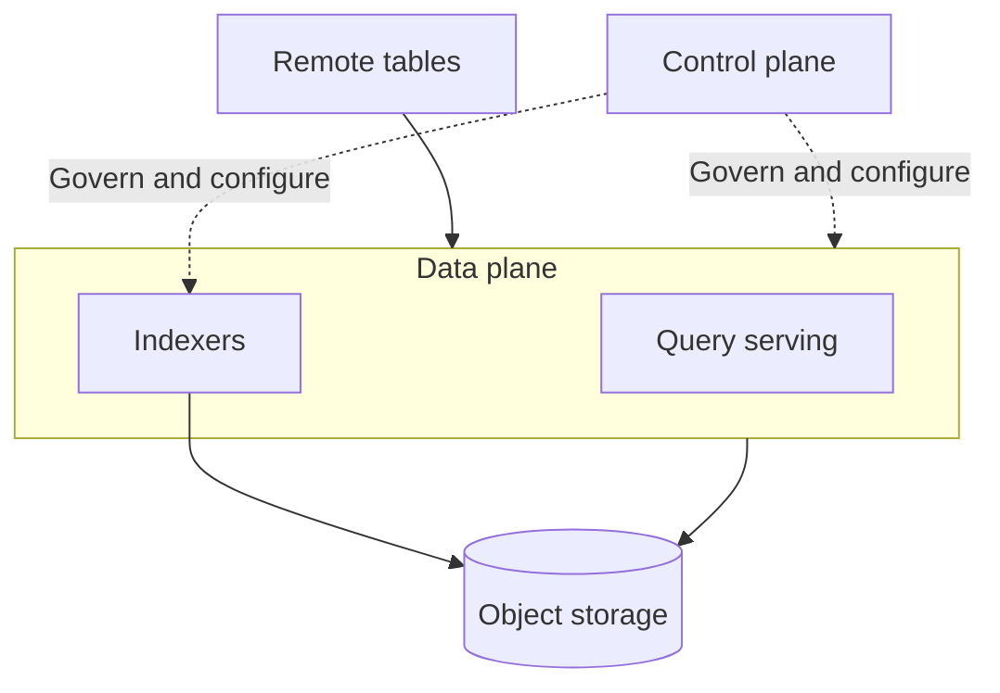
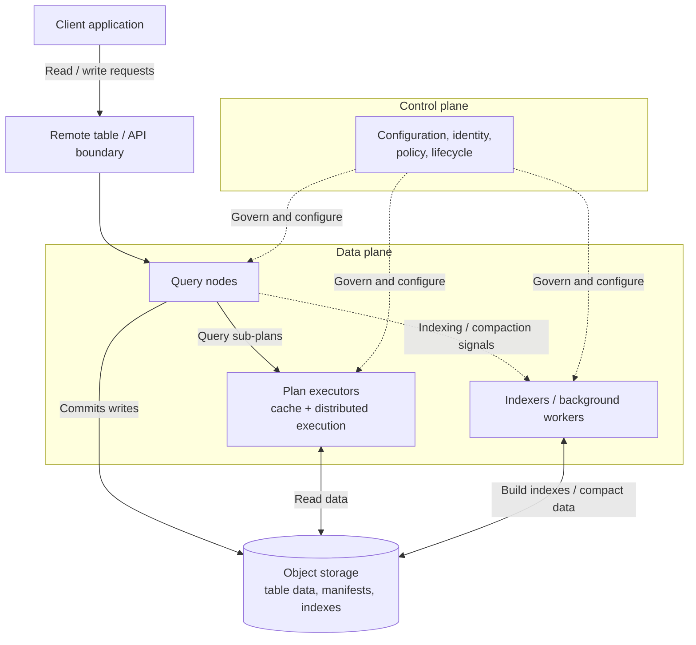

LanceDB Enterprise is a remote, cluster-backed service built for teams that need low-latency search, predictable operations, and durable storage beyond a single machine. Instead of tying query serving, indexing, compaction, and data persistence to the same process, Enterprise separates those concerns so each part of the system can scale and evolve independently.

At a high level, it helps to think of LanceDB Enterprise as a set of layers that interoperate with one another. Users connect to **remote tables** over the network. The **data plane** serves reads, writes and background jobs such as indexing and compaction. The **control plane** manages configuration, identity, policy, and cluster lifecycle. **Indexers** build indexes and compact data outside the request path. **Object storage** holds the durable table data, manifests, and index artifacts independently of the machines serving traffic.

This architecture matters because enterprise workloads are rarely shaped like a single benchmark. Some need thousands of concurrent queries. Others need large-scale ingestion, continuous indexing, or strict operational boundaries between user traffic and background work. LanceDB Enterprise is designed so those workloads do not all compete for the same machine, disk, or process.

## Compute-storage separation

In LanceDB Enterprise, storage and compute are deliberately decoupled. Table data and index artifacts live in object storage, while query-serving and background workers read from and write to that shared durable layer. This means compute can be replaced, scaled, or specialized without making any individual node the owner of the dataset.

This design has practical consequences. Query fleets can scale for interactive traffic without also scaling background indexing capacity. Heavy indexing and compaction work can run on dedicated workers instead of stealing resources from user-facing queries. Caches can accelerate hot reads without becoming the source of truth. And because the data remains in object storage, durability does not depend on the lifecycle of a particular server or local disk.

## Architecture

At a high level, the control plane governs the system and the data plane executes the work. The control plane is responsible for configuration, service discovery, identity integration, policy, and cluster lifecycle. It determines how the system should behave, but it is not the layer serving table data or executing user queries -- that's the role of the data plane.

Within the data plane, serving is separated into two kinds of nodes that are provisioned independently. Query nodes are the client-facing layer. They receive requests against remote tables, validate them, resolve the target table, plan the work, and return results.

Plan executors are the read-execution layer behind the query nodes. For read-heavy query paths, they execute cache-backed reads against object storage, which helps reduce repeated remote reads and makes performance more predictable as load grows.

Indexers handle heavyweight background work such as building indexes, merging index state, compacting data, and updating the table’s stored index and layout artifacts. Together, these components let LanceDB Enterprise scale request handling, read execution, and index-building independently instead of forcing them to compete for the same compute resources.

## Remote tables

A [remote table](/tables-and-namespaces#understanding-tables) is the user-facing abstraction over this architecture. From the client side, you connect to a logical storage layer and table over the network by providing a `db://...` connection identifier. The system then resolves that logical name to the underlying storage-backed table and executes the operation inside the cluster.

This is why Enterprise feels familiar at the API level while operationally behaving differently. Your application still issues table operations and queries, but it is no longer coupled to a local storage path or a single host. Instead, the cluster takes responsibility for execution, coordination, and background upkeep. In SDK terms, `open_table(...)` returns a `RemoteTable`. Architecturally, a remote table is the bridge between the client-facing API and the storage-backed system behind it.

This design makes LanceDB Enterprise suitable for catalog-backed layouts, see [Namespaces and the Catalog Model](/namespaces) for more details. For the basic application flow, see the [Enterprise quickstart](/enterprise/quickstart).

## Read path

When a client issues a query against a remote table, the path is straightforward:

1. The request reaches a query node in the data plane.
2. The query node validates the request, resolves the table, and plans the work.
3. For read-heavy queries, the query node can send part of the read work to plan executors.
4. Plan executors read the required table data from object storage, using cache where it helps reduce repeated remote reads.
5. Results are returned to the query node, assembled, and sent back to the client.

This separation is what lets Enterprise combine a clean remote API with a serving layer that can scale horizontally and keep hot data close to execution.

## Write path

Writes follow a different path because durability comes first:

1. A client writes to a remote table.
2. The query node validates the request and commits the new table state.
3. After the write succeeds, the system emits follow-up signals for indexing, compaction, or cleanup.

Keeping the commit path centered on object storage ensures that the durable record of the table lives outside any single query node. Regardless of whether you're using Lance namespaces or an external catalog, the catalog's role is mainly to resolve table names and provide access details -- the table’s actual data and index artifacts remain in object storage.

## Background work

Indexing, compaction, and cleanup are intentionally moved off the user request path. After table changes are committed, the system can determine that additional work is needed and assign it to background workers built for heavyweight processing.

In practice, that usually looks like this:

1. Table changes create follow-up signals for indexing, compaction, or cleanup.
2. A background coordinator agent evaluates the state of the table and decides what should run next.
3. Indexers read the relevant table state from object storage, produce updated artifacts, and write the results back.

This separation is one of the clearest architectural reasons to use LanceDB Enterprise: the same query-serving infrastructure does not have to handle every expensive indexing or compaction task itself.

## What this means for users

For teams using LanceDB Enterprise, the architecture changes the _operational model_ more than the programming model. You still work with tables and queries, but the cluster now takes responsibility for distributed execution, cache-aware reads, and long-running background jobs.

The result is a system that is easier to run under production pressure:

- You interact with remote tables instead of managing physical storage layout directly.
- Query serving, indexing, and compaction can scale independently.
- Durable state lives in object storage rather than on individual machines.
- Background indexing and compaction improve performance over time without forcing that work into the foreground request path.

This architecture gives ML and AI teams a strong storage-backed platform for training, retrieval, search, and analytics workloads that can scale beyond a single machine while still providing a familiar API and predictable performance.
