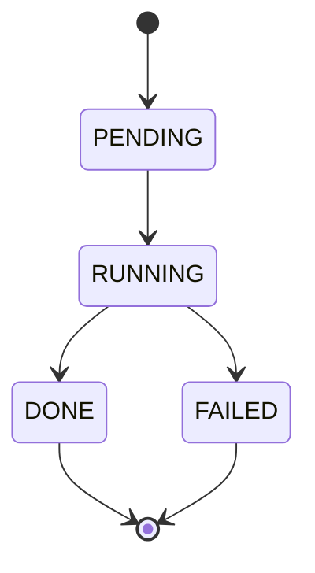

Geneva uses background jobs to execute long-running operations like backfills and materialized view refreshes. This guide explains how jobs work, their lifecycle states, and how to monitor and manage them.

## Overview

Jobs in Geneva are asynchronous operations that process data in the background. There are two primary job types:

| Job Type | Purpose | Created By |
|----------|---------|------------|
| **Backfill** | Compute column values using UDFs | `table.backfill()` |
| **Materialized View Refresh** | Update precomputed query results | `view.refresh()` |

Both job types share the same lifecycle states and monitoring capabilities.

## Job States

Every job progresses through a well-defined state machine:



| State | Description |
|-------|-------------|
| **PENDING** | Job has been created and is queued for execution |
| **RUNNING** | Job is actively processing data |
| **DONE** | Job completed successfully |
| **FAILED** | Job encountered an error during execution |

## Monitoring Jobs

### Querying Job Status

```python
import geneva

db = geneva.connect("/path/to/db")

# Get job state manager
jsm = db._history

# Get a specific job
job = jsm.get(job_id)[0]
print(f"Status: {job.status}")
print(f"Started: {job.launched_at}")
print(f"Completed: {job.completed_at}")

# List jobs for a table
pending_jobs = jsm.list_jobs(table_name="my_table", status="PENDING")
running_jobs = jsm.list_jobs(table_name="my_table", status="RUNNING")
```

### Progress Metrics

Jobs report progress through metrics:

```python
# Access job metrics
for metric in job.metrics:
    print(f"{metric['name']}: {metric['count']}/{metric['total']}")
```

Common metrics include:

| Metric | Description |
|--------|-------------|
| `tasks_completed` | Number of parallel tasks finished |
| `rows_processed` | Total rows processed by UDFs |
| `fragments_committed` | Fragments written to storage |

### Job Events

Jobs log significant events during execution:

```python
for event in job.events:
    print(f"{event['timestamp']}: {event['message']}")
```

Example events:
- "Job started"
- "Checkpointing complete for fragment 42"
- "Partial commit: 64 fragments"
- "Job completed successfully"

## Fault Tolerance

Geneva jobs are designed to be resilient to failures:

### Checkpoint-Based Recovery

Jobs save intermediate results to a checkpoint store. If a job fails:

1. **Completed work is preserved** - Checkpointed batches are not lost
2. **Resume from checkpoint** - Restarted jobs skip already-processed data
3. **No duplicate processing** - Each batch is processed exactly once

### Resuming Failed Jobs

To resume a failed job, simply re-run the same backfill or refresh command. The job will automatically detect existing checkpoints, skip already-processed fragments, and continue from where it left off.

## Troubleshooting

### Job Stuck in PENDING

- Check Ray cluster connectivity
- Verify sufficient cluster resources
- Look for errors in Ray dashboard

### Job Failed

```python
# Get errors for a specific job
errors = table.get_errors(job_id="abc123")
for error in errors:
    print(f"{error.error_type}: {error.error_message}")

# Get errors for a specific column
errors = table.get_errors(column_name="embedding")
```

Common failure causes:
- UDF exceptions on specific data
- Resource exhaustion (memory, disk)
- Network timeouts to external services
- Schema mismatches
