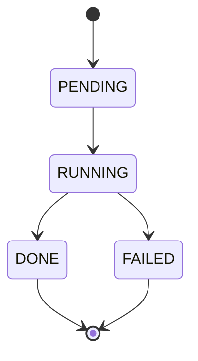

Geneva uses background jobs to execute long-running operations like backfills and materialized view refreshes. This guide explains how jobs work, their lifecycle states, and how to monitor and manage them.

## Overview

Jobs in Geneva are asynchronous operations that process data in the background. There are two primary job types:

| Job Type | Purpose | Created By |
|----------|---------|------------|
| **Backfill** | Compute column values using UDFs | `table.backfill()` |
| **Materialized View Refresh** | Update precomputed query results | `view.refresh()` |

Both job types share the same lifecycle states and monitoring capabilities.

## Job States

Every job progresses through a well-defined state machine:



| State | Description |
|-------|-------------|
| **PENDING** | Job has been created and is queued for execution |
| **RUNNING** | Job is actively processing data |
| **DONE** | Job completed successfully |
| **FAILED** | Job encountered an error during execution |

## Monitoring Jobs

The [Geneva Console](/geneva/jobs/console) provides a web-based interface for monitoring job status, progress, and history across your database. This is the recommended way to track jobs in collaborative environments.

For programmatic access, you can query job status directly via the API:

### Querying Job Status

```python
import geneva

db = geneva.connect("/path/to/db")

# Get job state manager
jsm = db._history

# Get a specific job
job = jsm.get(job_id)[0]
print(f"Status: {job.status}")
print(f"Started: {job.launched_at}")
print(f"Completed: {job.completed_at}")

# List jobs for a table
pending_jobs = jsm.list_jobs(table_name="my_table", status="PENDING")
running_jobs = jsm.list_jobs(table_name="my_table", status="RUNNING")
```

### Progress Metrics

Jobs report progress through metrics:

```python
# Access job metrics
for metric in job.metrics:
    print(f"{metric['name']}: {metric['count']}/{metric['total']}")
```

Common metrics include:

| Metric | Description |
|--------|-------------|
| `fragments` | [Fragments](https://lance.org/format/table/?h=fragment#fragments) scheduled for processing |
| `writer_fragments` | Fragments written to storage |
| `udf_values_computed` | Rows processed by UDFs |
| `rows_checkpointed` | Rows saved to checkpoint store |
| `rows_committed` | Rows committed to the table |
| `workers` | Workers started for parallel execution |

### Job Events

Jobs log significant events during execution:

```python
for event in job.events:
    print(f"{event['timestamp']}: {event['message']}")
```

Example events:
- "Job started"
- "Checkpointing complete for fragment 42"
- "Partial commit: 64 fragments"
- "Job completed successfully"

## Fault Tolerance

Geneva jobs are designed to be resilient to failures:

### Checkpoint-Based Recovery

Jobs save intermediate results to a checkpoint store. If a job fails:

1. **Completed work is preserved** - Checkpointed batches are not lost
2. **Resume from checkpoint** - Restarted jobs skip already-processed data
3. **No duplicate processing** - Each batch is processed exactly once

### Resuming Failed Jobs

To resume a failed job, simply re-run the same backfill or refresh command. The job will automatically detect existing checkpoints, skip already-processed fragments, and continue from where it left off.
