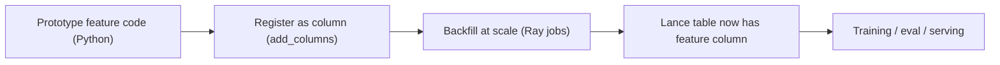

<Badge color="red">Enterprise-only</Badge>

You have a small team, a fast-moving product, and a dataset that keeps getting wider every week.
One day you're shipping a recommendation tweak, the next you're computing image embeddings,
then you decide you need OCR, then sentiment, then dedup signals, then you get the idea.

Feature engineering is supposed to be the fun part: turning raw data into signals your model can use.
In practice, it often turns into a second job: building and operating the machinery needed to compute
those features reliably and repeatedly.

Geneva, the feature engineering layer in LanceDB Enterprise, is written from
the perspective of an ML engineer who wants to move fast *without*
becoming the on-call owner of a bespoke distributed system.

## TL;DR

Geneva helps you:

- **Define features as columns** using Python UDFs (`Table.add_columns()`).
- **Backfill those columns at scale** as a checkpointed, resumable background job (`Table.backfill()`).
- **Scale from laptop to Kubernetes** using Ray under the hood, while abstracting away the Ray/KubeRay details.
- **Keep iteration tight** with filters, incremental refresh, and materialized views for training layouts.
- **Stay sane operationally** with dependency packaging, retries, conflict handling, and a job console.

If you want the short version: Geneva makes “write Python, run it everywhere, and store the result next to the data” at scale feel like a normal database operation.

## The Startup Feature Engineering Tax

At a startup, the constraints are usually clear:

- You need new signals quickly (the model quality curve is unforgiving).
- Your data is increasingly multimodal (text, images, audio, video, embeddings, metadata).
- You do not have a dedicated platform team to build and maintain a feature pipeline stack.

The first prototype is easy. The second is still fun. The tenth is where things go off the rails:

- How do you **recompute a feature** when your UDF changes?
- How do you **resume** when a long backfill dies halfway through?
- How do you **run expensive model inference** across millions of rows without reinventing a job system?
- How do you avoid “works on my laptop” when the cluster is Linux and you're on macOS?
- How do you keep this from becoming an Airflow + Ray + Docker + Kubernetes side project?

Geneva’s bet is simple: feature engineering should look like **table operations**.
You should be able to add a column, populate it, and query it — with the distributed machinery treated as an implementation detail.

## What Geneva Is

Geneva is a Python package (`geneva`) that lets you define features as **User Defined Functions (UDFs)** and register them
as **virtual columns** on a LanceDB table. Once a feature is registered, Geneva can populate it via a distributed,
checkpointed **backfill** job.

Conceptually:



The key idea is that your feature pipeline becomes a set of table columns with well-defined, reproducible compute behind them.

## The Happy Path: “Feature = Column”

Here’s the workflow that scales surprisingly well:

1. Write a Python function that computes a value from one row.
2. Wrap it with `@udf`.
3. Attach it as a new column via `Table.add_columns()`.
4. Trigger `Table.backfill()` when you’re ready to materialize it.

<CodeGroup>
```python Python icon="python"
from geneva import connect, udf

db = connect("s3://my-bucket/my-db")
tbl = db.get_table("products")

@udf
def title_len(title: str) -> int:
    return len(title)

tbl.add_columns({"title_len": title_len})
tbl.backfill("title_len")
```
</CodeGroup>

For small data, this is already a productivity win: the “feature engineering surface area” stays in Python, right next to the table.
For large data, the interesting part is what happens when you scale this up.

## Scale Without Rewriting Your Whole World

Geneva currently uses **Ray** as its execution backend. There are three common modes:

- **Local Ray** for prototyping: call `backfill()` and Geneva will spin up a local Ray cluster.
- **KubeRay on Kubernetes**: Geneva can automatically provision a RayCluster for the job.
- **An existing Ray cluster**: point Geneva at a running cluster.

From the ML engineer’s point of view, the goal is that *your feature code stays the same* and only the execution context changes.

### The Important Part: Geneva Hides the KubeRay Plumbing

KubeRay is a solid way to run Ray on Kubernetes — but wiring it up directly usually means becoming fluent in:
Ray cluster lifecycle, autoscaling behavior, runtime environments, packaging your code and dependencies, and operational glue.

Geneva treats that as an implementation detail. You define a cluster once, then run jobs inside a context:

<CodeGroup>
```python Python icon="python"
import sys
import ray
import geneva
from geneva.cluster.builder import GenevaClusterBuilder
from geneva.cluster import K8sConfigMethod

db = geneva.connect("s3://my-bucket/my-db")

ray_version = ray.__version__
python_version = f"{sys.version_info.major}.{sys.version_info.minor}"
cluster_name = "geneva-features"

cluster = (
    GenevaClusterBuilder()
    .name(cluster_name)
    .namespace("geneva")
    .portforwarding(True)
    .config_method(K8sConfigMethod.LOCAL)
    .head_group(service_account="geneva-sa", cpus=2)
    .add_cpu_worker_group(cpus=4, memory="8Gi", service_account="geneva-sa")
    .build()
)

db.define_cluster(cluster_name, cluster)

tbl = db.get_table("products")
with db.context(cluster=cluster_name):
    tbl.backfill("title_len")
```
</CodeGroup>

You still get Kubernetes-native execution and Ray parallelism, but Geneva handles the coordination and job lifecycle.
In other words: **you don’t need to design a KubeRay-based feature platform to backfill a column**.

## “But My Feature Code Has Dependencies…”

This is where many teams get stuck: the notebook has `pillow`, `torch`, and a handful of “one more thing” packages.
The cluster has a different Python version, or Linux wheels, or missing environment variables.

By default, Geneva will **package your local environment** (including `site-packages` and your working directory) and ship it to workers.
When you need more control, you can define a reusable **manifest**:

<CodeGroup>
```python Python icon="python"
from geneva.manifest.builder import GenevaManifestBuilder

manifest_name = "prod-features"
manifest = (
    GenevaManifestBuilder()
    .name(manifest_name)
    .skip_site_packages(False)
    .pip(["lancedb", "numpy", "pillow"])
    .build()
)

db.define_manifest(manifest_name, manifest)

with db.context(cluster="geneva-features", manifest=manifest_name):
    tbl.backfill("title_len")
```
</CodeGroup>

And if you ever hit the dreaded “it fails on the workers but not locally” problem, Geneva includes a dependency verification tool
to compare local and Ray worker environments.

## Make Long Jobs Boring

The fastest way to lose feature velocity is when backfills become scary.
Geneva’s job system is built around the idea that long-running feature computation should be:

- **Checkpointed**, so partial work isn’t lost.
- **Resumable**, so “re-run the same command” continues from where it left off.
- **Incremental**, so new data can be processed without rebuilding the world.

### Checkpoints and Adaptive Chunking

Backfills checkpoint batches of UDF results so failures don’t force you to start over.
You can also bound checkpoint sizing (or let Geneva adapt it) to get faster proof-of-life while staying efficient:

<CodeGroup>
```python Python icon="python"
from geneva import udf

@udf(min_checkpoint_size=25, max_checkpoint_size=200)
def expensive_feature(x: str) -> int:
    ...

tbl.add_columns({"expensive_feature": expensive_feature})
tbl.backfill("expensive_feature", min_checkpoint_size=10, max_checkpoint_size=100)
```
</CodeGroup>

### Concurrency That Maps to Your Compute

If your startup is doing GPU-heavy embedding or vision models, you want a knob that lines up with “how many accelerators do I have?”
Geneva exposes both process-level and thread-level concurrency on `backfill()`:

<CodeGroup>
```python Python icon="python"
# 10 processes * 5 threads = up to 50 concurrent UDF applications
tbl.backfill("embedding", concurrency=10, intra_applier_concurrency=5)
```
</CodeGroup>

### Real-World Features: Filters and Partial Visibility

Geneva includes a few pragmatic controls that matter when jobs run for hours or days:

- Run on a subset of data using `where=...` (SQL-style filters).
- Limit scope with `num_frags` to validate on a small sample.
- Use `commit_granularity` to make incremental progress visible to other readers.

These are small details that add up to something important: you can treat feature computation like an operational workflow,
not a one-shot script.

## Robustness When the Data Is Messy

Data is rarely clean. External APIs rate limit. Some rows are malformed.
Sometimes the “right” answer is to retry, sometimes it’s to skip, sometimes it’s to fail fast.

Geneva bakes error handling into the UDF definition:

<CodeGroup>
```python Python icon="python"
import pyarrow as pa
from geneva import udf, retry_transient

@udf(data_type=pa.string(), on_error=retry_transient(max_attempts=5))
def fetch_enrichment(url: str) -> str:
    return call_external_api(url)
```
</CodeGroup>

That means your distributed job can handle transient failures without you reinventing retry policies across workers.

## Training Layouts Without an Orchestrator: Materialized Views

Many teams end up building a separate “training table” pipeline: join sources, apply expensive UDFs, and write a dataset optimized
for a training loop. This is often where Airflow, Prefect, Dagster, and friends show up.

Geneva’s **materialized views** let you declare that pipeline as a query and refresh it incrementally:

<CodeGroup>
```python Python icon="python"
from geneva import udf

@udf
def normalize_title(title: str) -> str:
    return title.strip().lower()

q = (
    tbl.search(None)
    .select(
        {
            "product_id": "product_id",
            "title_norm": normalize_title,
            "title_len": "title_len",
        }
    )
)

view = db.create_materialized_view("products_training", q)
db.refresh("products_training")
```
</CodeGroup>

Now your “training dataset” is a first-class table that can be refreshed as new data arrives.

## Why This Works Well With LanceDB

Geneva is the execution layer, but the reason this feels natural is the storage layer underneath.

Lance (the format backing LanceDB) is built for multimodal AI workloads:

- Columnar storage with **fragments** (so work can be scheduled and written in parallel).
- Built-in **versioning** (so experiments are reproducible).
- Multimodal storage (vectors, text, images, audio, video) in one system.

For feature engineering, this matters because the “shape” of the work is column-oriented: you’re constantly adding new derived columns
and iterating on them.

And when your features become the backbone of production retrieval or training slices, LanceDB gives you indexing options that fit
real workflows:

- **Scalar indexes** (BTREE / BITMAP / LABEL_LIST) for fast filtering on metadata and feature columns.
- Vector and full-text search indexes for retrieval-heavy applications.

If your features include large binaries (images, clips, documents), Geneva can also work with **Lance Blobs** — a file-like type that lazily reads large objects —
so you can process multimodal data without forcing every worker to eagerly load huge payloads.

## A Mental Model That Scales with Your Team

If you’re a small ML team, you usually want:

- A workflow that starts in a notebook and becomes production without a rewrite.
- A place to store raw data *and* derived features together.
- A distributed execution engine that you don’t have to babysit.

Geneva’s model is intentionally simple:

- Features are columns.
- Backfills are jobs.
- Execution environments are contexts.

That’s the pitch: **fewer moving parts in your head** while still being able to scale to serious workloads.

## Next Steps

If you want to go deeper:

- Start with the Geneva overview: [Multimodal Feature Engineering with Geneva](/geneva/)
- Learn how UDFs work: [User-Defined Functions](/geneva/udfs/)
- Run and tune backfills: [Backfilling](/geneva/jobs/backfilling/) and [Performance](/geneva/jobs/performance/)
- Understand scaling and KubeRay contexts: [Execution Contexts](/geneva/jobs/contexts/)
- Build training layouts: [Materialized views](/geneva/jobs/materialized-views/)
- Debug dependency drift: [Dependency Verification](/geneva/deployment/dependency-verification/)
