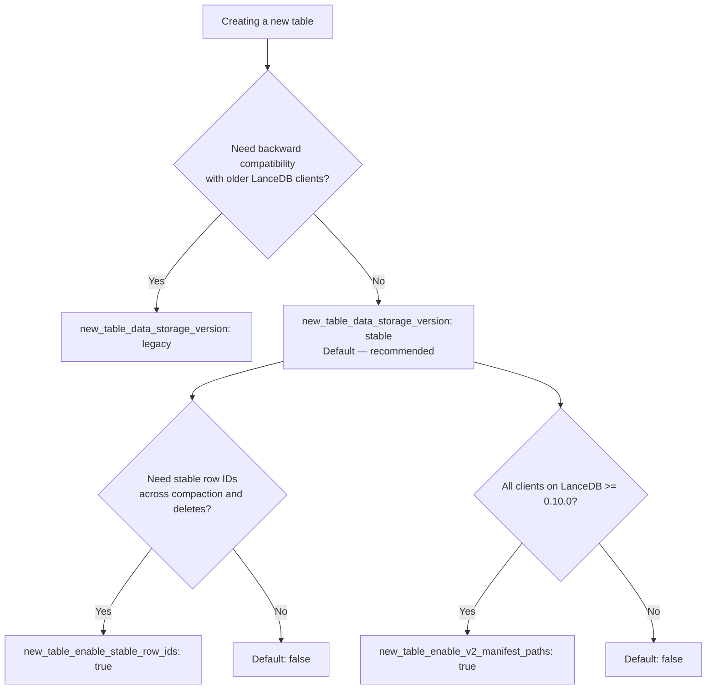

import {
    PyStorageAzureAccount,
    PyStorageAzureSas,
    PyStorageConnectAzure,
    PyStorageConnectGcs,
    PyStorageConnectS3,
    PyStorageConnectTimeout,
    PyStorageGcsServiceAccount,
    PyStorageS3Ddb,
    PyStorageS3DdbLocal,
    PyStorageS3Express,
    PyStorageS3Minio,
    PyStorageS3SseKms,
    PyStorageTableTimeout,
    PyStorageTigrisConnect,
    TsStorageAzureAccount,
    TsStorageAzureSas,
    TsStorageConnectAzure,
    TsStorageConnectGcs,
    TsStorageConnectS3,
    TsStorageConnectTimeout,
    TsStorageGcsServiceAccount,
    TsStorageS3Ddb,
    TsStorageS3DdbLocal,
    TsStorageS3Express,
    TsStorageS3Minio,
    TsStorageS3SseKms,
    TsStorageTableTimeout,
    TsStorageTigrisConnect,
} from '/snippets/storage.mdx';

When using LanceDB OSS, you can choose where to store your data. The tradeoffs between storage options are covered in the [storage architecture guide](/storage). This page shows how to configure each backend.

<Note>
**LanceDB Enterprise storage configuration**

In LanceDB Enterprise, you connect with `db://...` and the cluster owns the storage credentials, so `storage_options` are not passed at runtime. Cloud auth is set at deployment time. For federated databases, the namespace service vends per-request credentials automatically. See the [Enterprise quickstart](/enterprise/quickstart) and the [Azure deployment guide](/enterprise/deployment/azure) for the Enterprise flow.
</Note>

## Object stores

LanceDB supports AWS S3 (and compatible stores), Azure Blob Storage, and Google Cloud Storage. The URI scheme in your `connect` call selects the backend.

<CodeGroup>
    <CodeBlock filename="Python" language="Python" icon="python">
    {PyStorageConnectS3}
    </CodeBlock>
    <CodeBlock filename="TypeScript" language="TypeScript" icon="square-js">
    {TsStorageConnectS3}
    </CodeBlock>
</CodeGroup>

<CodeGroup>
    <CodeBlock filename="Python" language="Python" icon="python">
    {PyStorageConnectGcs}
    </CodeBlock>
    <CodeBlock filename="TypeScript" language="TypeScript" icon="square-js">
    {TsStorageConnectGcs}
    </CodeBlock>
</CodeGroup>

<CodeGroup>
    <CodeBlock filename="Python" language="Python" icon="python">
    {PyStorageConnectAzure}
    </CodeBlock>
    <CodeBlock filename="TypeScript" language="TypeScript" icon="square-js">
    {TsStorageConnectAzure}
    </CodeBlock>
</CodeGroup>

### Configuration options

When running inside the target cloud with correct IAM bindings, LanceDB often needs no extra configuration. When running elsewhere, provide credentials via environment variables or `storage_options`.

<CodeGroup>
    <CodeBlock filename="Python" language="Python" icon="python">
    {PyStorageConnectTimeout}
    </CodeBlock>
    <CodeBlock filename="TypeScript" language="TypeScript" icon="square-js">
    {TsStorageConnectTimeout}
    </CodeBlock>
</CodeGroup>

<Info>
**Storage option casing**

Keys are case-insensitive. Use lowercase in `storage_options` and uppercase in environment variables.
</Info>

Table-level `storage_options` inherit every key from the connection and override on a per-key basis. Pass them to `create_table` or `open_table` for options that should apply to a single table:

<CodeGroup>
    <CodeBlock filename="Python" language="Python" icon="python">
    {PyStorageTableTimeout}
    </CodeBlock>
    <CodeBlock filename="TypeScript" language="TypeScript" icon="square-js">
    {TsStorageTableTimeout}
    </CodeBlock>
</CodeGroup>

<Tip>
**Inspect the effective options**

On `AsyncTable`, `await table.initial_storage_options()` returns the options the table was opened with, and `await table.latest_storage_options()` returns the current options after any provider-driven refresh. The deprecated `table.storage_options()` method will be removed in a future release.
</Tip>

#### General object store options

| Key | Description |
| :-- | :-- |
| `allow_http` | Allow non-TLS connections. |
| `allow_invalid_certificates` | Skip certificate validation for TLS connections. |
| `connect_timeout` | Timeout for the connect phase. |
| `timeout` | Timeout for the full request. |
| `user_agent` | User agent string sent with requests. |
| `proxy_url` | Proxy URL to route requests through. |
| `proxy_ca_certificate` | PEM-formatted CA certificate for proxy connections. |
| `proxy_excludes` | Comma-separated hosts that bypass the proxy (domains or CIDR). |
| `download_retry_count` | Number of retries when downloading objects. |
| `client_max_retries` | Maximum retries for object-store client requests. |
| `client_retry_timeout` | Total retry timeout (seconds) for object-store client requests. |

<Info>
**Option support varies by backend**

These are commonly used options. Cloud-specific keys (for example `region`, `endpoint`, `service_account`, and Azure credential keys) are backend-dependent and can be provided in `storage_options` as needed.
</Info>

#### New table configuration

These options control the Lance file format and features used when creating new tables. Pass them via `storage_options` at connection or table level. They are evaluated only at table creation; setting them on an existing connection does not rewrite or alter tables that already exist.

| Key | Values | Default | Description |
| :-- | :-- | :-- | :-- |
| `new_table_data_storage_version` | `legacy`, `stable` | `stable` | Lance file format version for new tables. Use `legacy` for backward compatibility with older clients, or `stable` for the current format with better performance. |
| `new_table_enable_v2_manifest_paths` | `true`, `false` | `false` | Use v2 manifest path naming. Requires LanceDB >= 0.10.0 to read. |
| `new_table_enable_stable_row_ids` | `true`, `false` | `false` | Keep row IDs stable across compaction, delete, and merge operations. |



<CodeGroup>
```python Python icon="python"
import lancedb

# Set the Lance file format version at connection level
db = lancedb.connect(
    "s3://bucket/path",
    storage_options={
        "new_table_data_storage_version": "stable",
    },
)
```

```typescript TypeScript icon="square-js"
import * as lancedb from "@lancedb/lancedb";

// Set the Lance file format version at connection level
const db = await lancedb.connect("s3://bucket/path", {
  storageOptions: {
    newTableDataStorageVersion: "stable",
  },
});
```
</CodeGroup>

<Warning>
**Deprecated parameter**

The `data_storage_version` parameter on `create_table()` is deprecated. Use `new_table_data_storage_version` in `storage_options` instead.
</Warning>

## AWS S3


Set `AWS_ACCESS_KEY_ID`, `AWS_SECRET_ACCESS_KEY`, and optionally `AWS_SESSION_TOKEN` as environment variables or pass them in `storage_options`. Region is optional for AWS but required for most S3-compatible stores.

Minimum permissions usually include `s3:PutObject`, `s3:GetObject`, `s3:DeleteObject`, `s3:ListBucket`, and `s3:GetBucketLocation` scoped to the relevant bucket/prefix.

### S3-compatible stores

<CodeGroup>
    <CodeBlock filename="Python" language="Python" icon="python">
    {PyStorageS3Minio}
    </CodeBlock>
    <CodeBlock filename="TypeScript" language="TypeScript" icon="square-js">
    {TsStorageS3Minio}
    </CodeBlock>
</CodeGroup>

If the endpoint is `http://` (common in local development), also set `ALLOW_HTTP=true` or pass `allow_http=True` in `storage_options`.

### S3 Express

<CodeGroup>
    <CodeBlock filename="Python" language="Python" icon="python">
    {PyStorageS3Express}
    </CodeBlock>
    <CodeBlock filename="TypeScript" language="TypeScript" icon="square-js">
    {TsStorageS3Express}
    </CodeBlock>
</CodeGroup>

Consult AWS networking requirements for S3 Express before enabling.

### DynamoDB commit store for concurrent writes

S3 lacks atomic writes. To enable safe concurrent writers, use DynamoDB as a commit store by switching to the `s3+ddb` scheme and specifying the table name.

<CodeGroup>
    <CodeBlock filename="Python" language="Python" icon="python">
    {PyStorageS3Ddb}
    </CodeBlock>
    <CodeBlock filename="TypeScript" language="TypeScript" icon="square-js">
    {TsStorageS3Ddb}
    </CodeBlock>
</CodeGroup>

Create the DynamoDB table with hash key `base_uri` (string) and range key `version` (number). Small provisioned throughput (for example `ReadCapacityUnits=1`, `WriteCapacityUnits=1`) is sufficient for coordination.

The IAM principal that runs LanceDB needs `dynamodb:GetItem`, `dynamodb:PutItem`, and `dynamodb:DescribeTable` on the commit table, in addition to the usual S3 actions on the data bucket.

To point at a non-AWS endpoint (for example LocalStack during local development), set `dynamodb_endpoint` alongside the regular S3 options:

<CodeGroup>
    <CodeBlock filename="Python" language="Python" icon="python">
    {PyStorageS3DdbLocal}
    </CodeBlock>
    <CodeBlock filename="TypeScript" language="TypeScript" icon="square-js">
    {TsStorageS3DdbLocal}
    </CodeBlock>
</CodeGroup>

<Tip>
**Clean up failed multipart uploads**

LanceDB aborts multipart uploads on graceful shutdown, but crashes can leave incomplete uploads. Add an S3 lifecycle rule to delete in-progress uploads after a few days.
</Tip>

### Server-side encryption with KMS

To encrypt at rest with an AWS KMS key, set `aws_server_side_encryption` to `aws:kms` and `aws_sse_kms_key_id` to the key ID or ARN. The same options apply at connection or table level and combine with bucket-level default encryption.

<CodeGroup>
    <CodeBlock filename="Python" language="Python" icon="python">
    {PyStorageS3SseKms}
    </CodeBlock>
    <CodeBlock filename="TypeScript" language="TypeScript" icon="square-js">
    {TsStorageS3SseKms}
    </CodeBlock>
</CodeGroup>

The IAM principal needs `kms:Encrypt`, `kms:Decrypt`, and `kms:GenerateDataKey` on the configured KMS key.

## Google Cloud Storage


Provide credentials via `GOOGLE_SERVICE_ACCOUNT` (path to JSON) or include the path in `storage_options`. GCS defaults to HTTP/1; set `HTTP1_ONLY=false` if you need HTTP/2.

<CodeGroup>
    <CodeBlock filename="Python" language="Python" icon="python">
    {PyStorageGcsServiceAccount}
    </CodeBlock>
    <CodeBlock filename="TypeScript" language="TypeScript" icon="square-js">
    {TsStorageGcsServiceAccount}
    </CodeBlock>
</CodeGroup>

## Azure Blob Storage


Set `AZURE_STORAGE_ACCOUNT_NAME` and `AZURE_STORAGE_ACCOUNT_KEY` as environment variables, or pass them via `storage_options`.

<CodeGroup>
    <CodeBlock filename="Python" language="Python" icon="python">
    {PyStorageAzureAccount}
    </CodeBlock>
    <CodeBlock filename="TypeScript" language="TypeScript" icon="square-js">
    {TsStorageAzureAccount}
    </CodeBlock>
</CodeGroup>

For SAS-token auth, set `azure_storage_account_name` and `azure_storage_sas_token`:

<CodeGroup>
    <CodeBlock filename="Python" language="Python" icon="python">
    {PyStorageAzureSas}
    </CodeBlock>
    <CodeBlock filename="TypeScript" language="TypeScript" icon="square-js">
    {TsStorageAzureSas}
    </CodeBlock>
</CodeGroup>

Other supported keys include service principal credentials (`azure_client_id`, `azure_client_secret`, `azure_tenant_id`), managed identities, and custom endpoints.

## Tigris Object Storage


Tigris exposes an S3-compatible API. Configure the endpoint and region:

<CodeGroup>
    <CodeBlock filename="Python" language="Python" icon="python">
    {PyStorageTigrisConnect}
    </CodeBlock>
    <CodeBlock filename="TypeScript" language="TypeScript" icon="square-js">
    {TsStorageTigrisConnect}
    </CodeBlock>
</CodeGroup>

Environment variables `AWS_ENDPOINT=https://t3.storage.dev` and `AWS_DEFAULT_REGION=auto` achieve the same configuration.
