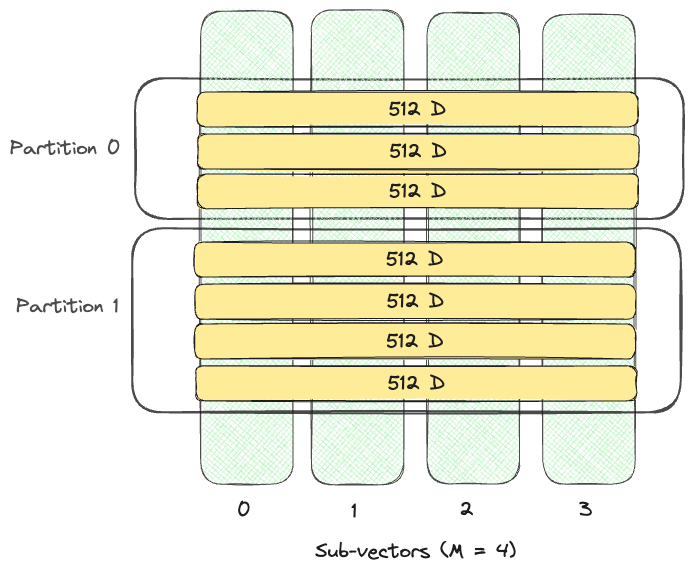
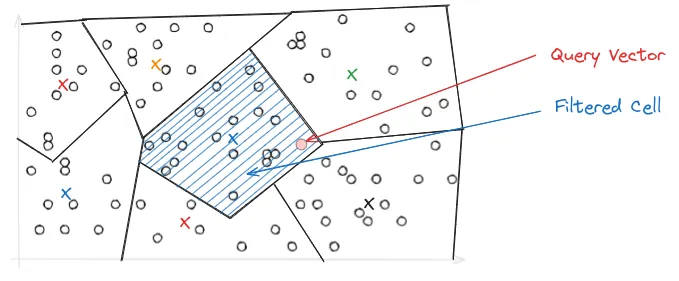

# Approximate Nearest Neighbor (ANN) Indexes

An ANN or a vector index is a data structure specifically designed to efficiently organize and
search vector data based on their similarity via the chosen distance metric.
By constructing a vector index, the search space is effectively narrowed down, avoiding the need
for brute-force scanning of the entire vector space.
A vector index is faster but less accurate than exhaustive search (kNN or flat search).
LanceDB provides many parameters to fine-tune the index's size, the speed of queries, and the accuracy of results.

## Disk-based Index

Lance provides an `IVF_PQ` disk-based index. It uses **Inverted File Index (IVF)** to first divide
the dataset into `N` partitions, and then applies **Product Quantization** to compress vectors in each partition.
See the [indexing]LINK(index_ivfpq.md) concepts guide for more information on how this works.

## Creating an IVF_PQ Index

Lance supports `IVF_PQ` index type by default.

=== "Python"
    === "Sync API"

        Creating indexes is done via the [create_index](https://lancedb.github.io/lancedb/python/#lancedb.table.LanceTable.create_index) method.

        ```python
        --8<-- "python/python/tests/docs/test_guide_index.py:import-lancedb"
        --8<-- "python/python/tests/docs/test_guide_index.py:import-numpy"
        --8<-- "python/python/tests/docs/test_guide_index.py:create_ann_index"
        ```
    === "Async API"
        Creating indexes is done via the [create_index](https://lancedb.github.io/lancedb/python/#lancedb.table.LanceTable.create_index) method.

        ```python
        --8<-- "python/python/tests/docs/test_guide_index.py:import-lancedb"
        --8<-- "python/python/tests/docs/test_guide_index.py:import-numpy"
        --8<-- "python/python/tests/docs/test_guide_index.py:import-lancedb-ivfpq"
        --8<-- "python/python/tests/docs/test_guide_index.py:create_ann_index_async"
        ```

=== "TypeScript"

    === "@lancedb/lancedb"

        Creating indexes is done via the [lancedb.Table.createIndex]LINK(../js/classes/Table.md/#createIndex) method.

        ```typescript
        --8<--- "nodejs/examples/ann_indexes.test.ts:import"

        --8<-- "nodejs/examples/ann_indexes.test.ts:ingest"
        ```

    === "vectordb (deprecated)"

        Creating indexes is done via the [lancedb.Table.createIndex]LINK(../javascript/interfaces/Table.md/#createIndex) method.

        ```typescript
        --8<--- "docs/src/ann_indexes.ts:import"

        --8<-- "docs/src/ann_indexes.ts:ingest"
        ```

=== "Rust"

    ```rust
    --8<-- "rust/lancedb/examples/ivf_pq.rs:create_index"
    ```

    IVF_PQ index parameters are more fully defined in the [crate docs](https://docs.rs/lancedb/latest/lancedb/index/vector/struct.IvfPqIndexBuilder.html).

The following IVF_PQ paramters can be specified:

- **distance_type**: The distance metric to use. By default it uses euclidean distance "`l2`".
  We also support "cosine" and "dot" distance as well.
- **num_partitions**: The number of partitions in the index. The default is the square root
  of the number of rows.

!!! note

    In the synchronous python SDK and node's `vectordb` the default is 256. This default has
    changed in the asynchronous python SDK and node's `lancedb`.

- **num_sub_vectors**: The number of sub-vectors (M) that will be created during Product Quantization (PQ).
  For D dimensional vector, it will be divided into `M` subvectors with dimension `D/M`, each of which is replaced by
  a single PQ code. The default is the dimension of the vector divided by 16.
- **num_bits**: The number of bits used to encode each sub-vector. Only 4 and 8 are supported. The higher the number of bits, the higher the accuracy of the index, also the slower search. The default is 8.

!!! note

    In the synchronous python SDK and node's `vectordb` the default is currently 96. This default has
    changed in the asynchronous python SDK and node's `lancedb`.

<figure markdown>
  
  <figcaption>IVF_PQ index with <code>num_partitions=2, num_sub_vectors=4</code></figcaption>
</figure>

### Use GPU to build vector index

Lance Python SDK has experimental GPU support for creating IVF index.
Using GPU for index creation requires [PyTorch>2.0](https://pytorch.org/) being installed.

You can specify the GPU device to train IVF partitions via

- **accelerator**: Specify to `cuda` or `mps` (on Apple Silicon) to enable GPU training.

=== "Linux"

    <!-- skip-test -->
    ``` { .python .copy }
    # Create index using CUDA on Nvidia GPUs.
    tbl.create_index(
        num_partitions=256,
        num_sub_vectors=96,
        accelerator="cuda"
    )
    ```

=== "MacOS"

    <!-- skip-test -->
    ```python
    # Create index using MPS on Apple Silicon.
    tbl.create_index(
        num_partitions=256,
        num_sub_vectors=96,
        accelerator="mps"
    )
    ```
!!! note
    GPU based indexing is not yet supported with our asynchronous client.
    
Troubleshooting:

If you see `AssertionError: Torch not compiled with CUDA enabled`, you need to [install
PyTorch with CUDA support](https://pytorch.org/get-started/locally/).

## Querying an ANN Index

Querying vector indexes is done via the [search](https://lancedb.github.io/lancedb/python/#lancedb.table.LanceTable.search) function.

There are a couple of parameters that can be used to fine-tune the search:

- **limit** (default: 10): The amount of results that will be returned
- **nprobes** (default: 20): The number of probes used. A higher number makes search more accurate but also slower.<br/>
  Most of the time, setting nprobes to cover 5-15% of the dataset should achieve high recall with low latency.<br/>
    - _For example_, For a dataset of 1 million vectors divided into 256 partitions, `nprobes` should be set to ~20-40. This value can be adjusted to achieve the optimal balance between search latency and search quality. <br/>

- **refine_factor** (default: None): Refine the results by reading extra elements and re-ranking them in memory.<br/>
  A higher number makes search more accurate but also slower. If you find the recall is less than ideal, try refine_factor=10 to start.<br/>
    - _For example_, For a dataset of 1 million vectors divided into 256 partitions, setting the `refine_factor` to 200 will initially retrieve the top 4,000 candidates (top k * refine_factor) from all searched partitions. These candidates are then reranked to determine the final top 20 results.<br/>
!!! note
    Both `nprobes` and `refine_factor` are only applicable if an ANN index is present. If specified on a table without an ANN index, those parameters are ignored.


=== "Python"
    === "Sync API"

        ```python
        --8<-- "python/python/tests/docs/test_guide_index.py:vector_search"
        ```
    === "Async API"

        ```python
        --8<-- "python/python/tests/docs/test_guide_index.py:vector_search_async"
        ```

    ```text
                                              vector       item       _distance
    0  [0.44949695, 0.8444449, 0.06281311, 0.23338133...  item 1141  103.575333
    1  [0.48587373, 0.269207, 0.15095535, 0.65531915,...  item 3953  108.393867
    ```

=== "TypeScript"

    === "@lancedb/lancedb"

        ```typescript
        --8<-- "nodejs/examples/ann_indexes.test.ts:search1"
        ```

    === "vectordb (deprecated)"

        ```typescript
        --8<-- "docs/src/ann_indexes.ts:search1"
        ```

=== "Rust"

    ```rust
    --8<-- "rust/lancedb/examples/ivf_pq.rs:search1"
    ```

    Vector search options are more fully defined in the [crate docs](https://docs.rs/lancedb/latest/lancedb/query/struct.Query.html#method.nearest_to).

The search will return the data requested in addition to the distance of each item.

### Filtering (where clause)

You can further filter the elements returned by a search using a where clause.

=== "Python"
    === "Sync API"

        ```python
        --8<-- "python/python/tests/docs/test_guide_index.py:vector_search_with_filter"
        ```
    === "Async API"

        ```python
        --8<-- "python/python/tests/docs/test_guide_index.py:vector_search_async_with_filter"
        ```

=== "TypeScript"

    === "@lancedb/lancedb"

        ```typescript
        --8<-- "nodejs/examples/ann_indexes.test.ts:search2"
        ```

    === "vectordb (deprecated)"

        ```javascript
        --8<-- "docs/src/ann_indexes.ts:search2"
        ```

### Projections (select clause)

You can select the columns returned by the query using a select clause.

=== "Python"

    === "Sync API"

        ```python
        --8<-- "python/python/tests/docs/test_guide_index.py:vector_search_with_select"
        ```
    === "Async API"

        ```python
        --8<-- "python/python/tests/docs/test_guide_index.py:vector_search_async_with_select"
        ```

    ```text
                                                vector _distance
    0  [0.30928212, 0.022668175, 0.1756372, 0.4911822...  93.971092
    1  [0.2525465, 0.01723831, 0.261568, 0.002007689,...  95.173485
    ...
    ```

=== "TypeScript"

    === "@lancedb/lancedb"

        ```typescript
        --8<-- "nodejs/examples/ann_indexes.test.ts:search3"
        ```

    === "vectordb (deprecated)"

        ```typescript
        --8<-- "docs/src/ann_indexes.ts:search3"
        ```

## FAQ

### Why do I need to manually create an index?

Currently, LanceDB does _not_ automatically create the ANN index.
LanceDB is well-optimized for kNN (exhaustive search) via a disk-based index. For many use-cases,
datasets of the order of ~100K vectors don't require index creation. If you can live with up to
100ms latency, skipping index creation is a simpler workflow while guaranteeing 100% recall.

### When is it necessary to create an ANN vector index?

`LanceDB` comes out-of-the-box with highly optimized SIMD code for computing vector similarity.
In our benchmarks, computing distances for 100K pairs of 1K dimension vectors takes **less than 20ms**.
We observe that for small datasets (~100K rows) or for applications that can accept 100ms latency,
vector indices are usually not necessary.

For large-scale or higher dimension vectors, it can beneficial to create vector index for performance.

### How big is my index, and how many memory will it take?

In LanceDB, all vector indices are **disk-based**, meaning that when responding to a vector query, only the relevant pages from the index file are loaded from disk and cached in memory. Additionally, each sub-vector is usually encoded into 1 byte PQ code.

For example, with a 1024-dimension dataset, if we choose `num_sub_vectors=64`, each sub-vector has `1024 / 64 = 16` float32 numbers.
Product quantization can lead to approximately `16 * sizeof(float32) / 1 = 64` times of space reduction.

### How to choose `num_partitions` and `num_sub_vectors` for `IVF_PQ` index?

`num_partitions` is used to decide how many partitions the first level `IVF` index uses.
Higher number of partitions could lead to more efficient I/O during queries and better accuracy, but it takes much more time to train.
On `SIFT-1M` dataset, our benchmark shows that keeping each partition 1K-4K rows lead to a good latency / recall.

`num_sub_vectors` specifies how many Product Quantization (PQ) short codes to generate on each vector. The number should be a factor of the vector dimension. Because
PQ is a lossy compression of the original vector, a higher `num_sub_vectors` usually results in
less space distortion, and thus yields better accuracy. However, a higher `num_sub_vectors` also causes heavier I/O and more PQ computation, and thus, higher latency. `dimension / num_sub_vectors` should be a multiple of 8 for optimum SIMD efficiency.

!!! note
    if `num_sub_vectors` is set to be greater than the vector dimension, you will see errors like `attempt to divide by zero`

### How to choose `m` and `ef_construction` for `IVF_HNSW_*` index?

`m` determines the number of connections a new node establishes with its closest neighbors upon entering the graph. Typically, `m` falls within the range of 5 to 48. Lower `m` values are suitable for low-dimensional data or scenarios where recall is less critical. Conversely, higher `m` values are beneficial for high-dimensional data or when high recall is required. In essence, a larger `m` results in a denser graph with increased connectivity, but at the expense of higher memory consumption.

`ef_construction` balances build speed and accuracy. Higher values increase accuracy but slow down the build process. A typical range is 150 to 300. For good search results, a minimum value of 100 is recommended. In most cases, setting this value above 500 offers no additional benefit. Ensure that `ef_construction` is always set to a value equal to or greater than `ef` in the search phase


# Understanding LanceDB's IVF-PQ index

An ANN (Approximate Nearest Neighbors) index is a data structure that represents data in a way that makes it more efficient to search and retrieve. Using an ANN index is faster, but less accurate than kNN or brute force search because, in essence, the index is a lossy representation of the data.

LanceDB is fundamentally different from other vector databases in that it is built on top of [Lance](https://github.com/lancedb/lance), an open-source columnar data format designed for performant ML workloads and fast random access. Due to the design of Lance, LanceDB's indexing philosophy adopts a primarily *disk-based* indexing philosophy.

## IVF-PQ

IVF-PQ is a composite index that combines inverted file index (IVF) and product quantization (PQ). The implementation in LanceDB provides several parameters to fine-tune the index's size, query throughput, latency and recall, which are described later in this section.

### Product quantization

Quantization is a compression technique used to reduce the dimensionality of an embedding to speed up search.

Product quantization (PQ) works by dividing a large, high-dimensional vector of size into equally sized subvectors. Each subvector is assigned a "reproduction value" that maps to the nearest centroid of points for that subvector. The reproduction values are then assigned to a codebook using unique IDs, which can be used to reconstruct the original vector.


It's important to remember that quantization is a *lossy process*, i.e., the reconstructed vector is not identical to the original vector. This results in a trade-off between the size of the index and the accuracy of the search results.

As an example, consider starting with 128-dimensional vector consisting of 32-bit floats. Quantizing it to an 8-bit integer vector with 4 dimensions as in the image above, we can significantly reduce memory requirements.

!!! example "Effect of quantization"

    Original: `128 × 32 = 4096` bits
    Quantized: `4 × 8 = 32` bits

    Quantization results in a **128x** reduction in memory requirements for each vector in the index, which is substantial.

### Inverted file index

While PQ helps with reducing the size of the index, IVF primarily addresses search performance. The primary purpose of an inverted file index is to facilitate rapid and effective nearest neighbor search by narrowing down the search space.

In IVF, the PQ vector space is divided into *Voronoi cells*, which are essentially partitions that consist of all the points in the space that are within a threshold distance of the given region's seed point. These seed points are initialized by running K-means over the stored vectors. The centroids of K-means turn into the seed points which then each define a region. These regions are then are used to create an inverted index that correlates each centroid with a list of vectors in the space, allowing a search to be restricted to just a subset of vectors in the index.


During query time, depending on where the query lands in vector space, it may be close to the border of multiple Voronoi cells, which could make the top-k results ambiguous and span across multiple cells. To address this, the IVF-PQ introduces the `nprobe` parameter, which controls the number of Voronoi cells to search during a query. The higher the `nprobe`, the more accurate the results, but the slower the query.



## Putting it all together

We can combine the above concepts to understand how to build and query an IVF-PQ index in LanceDB.

### Construct index

There are three key parameters to set when constructing an IVF-PQ index:

* `metric`: Use an `l2` euclidean distance metric. We also support `dot` and `cosine` distance.
* `num_partitions`: The number of partitions in the IVF portion of the index.
* `num_sub_vectors`: The number of sub-vectors that will be created during Product Quantization (PQ).

In Python, the index can be created as follows:

```python
# Create and train the index for a 1536-dimensional vector
# Make sure you have enough data in the table for an effective training step
tbl.create_index(metric="l2", num_partitions=256, num_sub_vectors=96)
```
!!! note
    `num_partitions`=256 and `num_sub_vectors`=96 does not work for every dataset. Those values needs to be adjusted for your particular dataset.

The `num_partitions` is usually chosen to target a particular number of vectors per partition. `num_sub_vectors` is typically chosen based on the desired recall and the dimensionality of the vector. See [here](index.md/#how-to-choose-num_partitions-and-num_sub_vectors-for-ivf_pq-index) for best practices on choosing these parameters.


### Query the index

```python
# Search using a random 1536-dimensional embedding
tbl.search(np.random.random((1536))) \
    .limit(2) \
    .nprobes(20) \
    .refine_factor(10) \
    .to_pandas()
```

The above query will perform a search on the table `tbl` using the given query vector, with the following parameters:

* `limit`: The number of results to return
* `nprobes`: The number of probes determines the distribution of vector space. While a higher number enhances search accuracy, it also results in slower performance. Typically, setting `nprobes` to cover 5–10% of the dataset proves effective in achieving high recall with minimal latency.
* `refine_factor`: Refine the results by reading extra elements and re-ranking them in memory. A higher number makes the search more accurate but also slower (see the [FAQ]LINK(../faq.md#do-i-need-to-set-a-refine-factor-when-using-an-index) page for more details on this).
* `to_pandas()`: Convert the results to a pandas DataFrame

And there you have it! You now understand what an IVF-PQ index is, and how to create and query it in LanceDB.
To see how to create an IVF-PQ index in LanceDB, take a look at the [ANN indexes](index.md) section.


# Understanding HNSW index

Approximate Nearest Neighbor (ANN) search is a method for finding data points near a given point in a dataset, though not always the exact nearest one. HNSW is one of the most accurate and fastest Approximate Nearest Neighbour search algorithms, It’s beneficial in high-dimensional spaces where finding the same nearest neighbor would be too slow and costly

[Jump to usage](#usage)
There are three main types of ANN search algorithms:

* **Tree-based search algorithms**: Use a tree structure to organize and store data points.
* **Hash-based search algorithms**: Use a specialized geometric hash table to store and manage data points. These algorithms typically focus on theoretical guarantees, and don't usually perform as well as the other approaches in practice.
* **Graph-based search algorithms**: Use a graph structure to store data points, which can be a bit complex. 

HNSW is a graph-based algorithm. All graph-based search algorithms rely on the idea of a k-nearest neighbor (or k-approximate nearest neighbor) graph, which we outline below.  
HNSW also combines this with the ideas behind a classic 1-dimensional search data structure: the skip list.

## k-Nearest Neighbor Graphs and k-approximate Nearest neighbor Graphs
The k-nearest neighbor graph actually predates its use for ANN search. Its construction is quite simple:

* Each vector in the dataset is given an associated vertex.
* Each vertex has outgoing edges to its k nearest neighbors. That is, the k closest other vertices by Euclidean distance between the two corresponding vectors. This can be thought of as a "friend list" for the vertex.
* For some applications (including nearest-neighbor search), the incoming edges are also added.

Eventually, it was realized that the following greedy search method over such a graph typically results in good approximate nearest neighbors:

* Given a query vector, start at some fixed "entry point" vertex (e.g. the approximate center node).
* Look at that vertex's neighbors. If any of them are closer to the query vector than the current vertex, then move to that vertex.
* Repeat until a local optimum is found.

The above algorithm also generalizes to e.g. top 10 approximate nearest neighbors.

Computing a k-nearest neighbor graph is actually quite slow, taking quadratic time in the dataset size. It was quickly realized that near-identical performance can be achieved using a k-approximate nearest neighbor graph. That is, instead of obtaining the k-nearest neighbors for each vertex, an approximate nearest neighbor search data structure is used to build much faster.  
In fact, another data structure is not needed: This can be done "incrementally".
That is, if you start with a k-ANN graph for n-1 vertices, you can extend it to a k-ANN graph for n vertices as well by using the graph to obtain the k-ANN for the new vertex.

One downside of k-NN and k-ANN graphs alone is that one must typically build them with a large value of k to get decent results, resulting in a large index.


## HNSW: Hierarchical Navigable Small Worlds

HNSW builds on k-ANN in two main ways:

* Instead of getting the k-approximate nearest neighbors for a large value of k, it sparsifies the k-ANN graph using a carefully chosen "edge pruning" heuristic, allowing for the number of edges per vertex to be limited to a relatively small constant.
* The "entry point" vertex is chosen dynamically using a recursively constructed data structure on a subset of the data, similarly to a skip list.

This recursive structure can be thought of as separating into layers:

* At the bottom-most layer, an k-ANN graph on the whole dataset is present.
* At the second layer, a k-ANN graph on a fraction of the dataset (e.g. 10%) is present.
* At the Lth layer, a k-ANN graph is present. It is over a (constant) fraction (e.g. 10%) of the vectors/vertices present in the L-1th layer.

Then the greedy search routine operates as follows:

* At the top layer (using an arbitrary vertex as an entry point), use the greedy local search routine on the k-ANN graph to get an approximate nearest neighbor at that layer.
* Using the approximate nearest neighbor found in the previous layer as an entry point, find an approximate nearest neighbor in the next layer with the same method.
* Repeat until the bottom-most layer is reached. Then use the entry point to find multiple nearest neighbors (e.g. top 10).


## Usage

There are three key parameters to set when constructing an HNSW index:

* `metric`: Use an `l2` euclidean distance metric. We also support `dot` and `cosine` distance.
* `m`: The number of neighbors to select for each vector in the HNSW graph.
* `ef_construction`: The number of candidates to evaluate during the construction of the HNSW graph.


We can combine the above concepts to understand how to build and query an HNSW index in LanceDB.

### Construct index

```python
import lancedb
import numpy as np
uri = "/tmp/lancedb"
db = lancedb.connect(uri)

# Create 10,000 sample vectors
data = [
    {"vector": row, "item": f"item {i}"}
    for i, row in enumerate(np.random.random((10_000, 1536)).astype('float32'))
]

# Add the vectors to a table
tbl = db.create_table("my_vectors", data=data)

# Create and train the HNSW index for a 1536-dimensional vector
# Make sure you have enough data in the table for an effective training step
tbl.create_index(index_type=IVF_HNSW_SQ)

```

### Query the index

```python
# Search using a random 1536-dimensional embedding
tbl.search(np.random.random((1536))) \
    .limit(2) \
    .to_pandas()
```


# Building a Scalar Index

Scalar indices organize data by scalar attributes (e.g. numbers, categorical values), enabling fast filtering of vector data. In vector databases, scalar indices accelerate the retrieval of scalar data associated with vectors, thus enhancing the query performance when searching for vectors that meet certain scalar criteria. 

Similar to many SQL databases, LanceDB supports several types of scalar indices to accelerate search
over scalar columns.

- `BTREE`: The most common type is BTREE. The index stores a copy of the
  column in sorted order. This sorted copy allows a binary search to be used to
  satisfy queries.
- `BITMAP`: this index stores a bitmap for each unique value in the column. It 
  uses a series of bits to indicate whether a value is present in a row of a table
- `LABEL_LIST`: a special index that can be used on `List<T>` columns to
  support queries with `array_contains_all` and `array_contains_any`
  using an underlying bitmap index.
  For example, a column that contains lists of tags (e.g. `["tag1", "tag2", "tag3"]`) can be indexed with a `LABEL_LIST` index.

!!! tips "How to choose the right scalar index type"

    `BTREE`: This index is good for scalar columns with mostly distinct values and does best when the query is highly selective.
    
    `BITMAP`: This index works best for low-cardinality numeric or string columns, where the number of unique values is small (i.e., less than a few thousands).
    
    `LABEL_LIST`: This index should be used for columns containing list-type data.

| Data Type                                                       | Filter                                    | Index Type   |
| --------------------------------------------------------------- | ----------------------------------------- | ------------ |
| Numeric, String, Temporal                                       | `<`, `=`, `>`, `in`, `between`, `is null` | `BTREE`      |
| Boolean, numbers or strings with fewer than 1,000 unique values | `<`, `=`, `>`, `in`, `between`, `is null` | `BITMAP`     |
| List of low cardinality of numbers or strings                   | `array_has_any`, `array_has_all`          | `LABEL_LIST` |

### Create a scalar index
=== "Python"

    === "Sync API"

        ```python
        --8<-- "python/python/tests/docs/test_guide_index.py:import-lancedb"
        --8<-- "python/python/tests/docs/test_guide_index.py:import-lancedb-btree-bitmap"
        --8<-- "python/python/tests/docs/test_guide_index.py:basic_scalar_index"
        ```
    === "Async API"

        ```python
        --8<-- "python/python/tests/docs/test_guide_index.py:import-lancedb"
        --8<-- "python/python/tests/docs/test_guide_index.py:import-lancedb-btree-bitmap"
        --8<-- "python/python/tests/docs/test_guide_index.py:basic_scalar_index_async"
        ```

=== "Typescript"

    === "@lancedb/lancedb"

        ```js
        const db = await lancedb.connect("data");
        const tbl = await db.openTable("my_vectors");

        await tbl.create_index("book_id");
        await tlb.create_index("publisher", { config: lancedb.Index.bitmap() })
        ```

The following scan will be faster if the column `book_id` has a scalar index:

=== "Python"

    === "Sync API"

        ```python
        --8<-- "python/python/tests/docs/test_guide_index.py:import-lancedb"
        --8<-- "python/python/tests/docs/test_guide_index.py:search_with_scalar_index"
        ```
    === "Async API"

        ```python
        --8<-- "python/python/tests/docs/test_guide_index.py:import-lancedb"
        --8<-- "python/python/tests/docs/test_guide_index.py:search_with_scalar_index_async"
        ```

=== "Typescript"

    === "@lancedb/lancedb"

        ```js
        const db = await lancedb.connect("data");
        const tbl = await db.openTable("books");

        await tbl
          .query()
          .where("book_id = 2")
          .limit(10)
          .toArray();
        ```

Scalar indices can also speed up scans containing a vector search or full text search, and a prefilter:

=== "Python"

    === "Sync API"

        ```python
        --8<-- "python/python/tests/docs/test_guide_index.py:import-lancedb"
        --8<-- "python/python/tests/docs/test_guide_index.py:vector_search_with_scalar_index"
        ```
    === "Async API"

        ```python
        --8<-- "python/python/tests/docs/test_guide_index.py:import-lancedb"
        --8<-- "python/python/tests/docs/test_guide_index.py:vector_search_with_scalar_index_async"
        ```

=== "Typescript"

    === "@lancedb/lancedb"

        ```js
        const db = await lancedb.connect("data/lance");
        const tbl = await db.openTable("book_with_embeddings");

        await tbl.search(Array(1536).fill(1.2))
          .where("book_id != 3")  // prefilter is default behavior.
          .limit(10)
          .toArray();
        ```
### Update a scalar index
Updating the table data (adding, deleting, or modifying records) requires that you also update the scalar index. This can be done by calling `optimize`, which will trigger an update to the existing scalar index.
=== "Python"

    === "Sync API"

        ```python
        --8<-- "python/python/tests/docs/test_guide_index.py:update_scalar_index"
        ```
    === "Async API"

        ```python
        --8<-- "python/python/tests/docs/test_guide_index.py:update_scalar_index_async"
        ```

=== "TypeScript"

    ```typescript
    await tbl.add([{ vector: [7, 8], book_id: 4 }]);
    await tbl.optimize();
    ```

=== "Rust"

    ```rust
    let more_data: Box<dyn RecordBatchReader + Send> = create_some_records()?;
    tbl.add(more_data).execute().await?;
    tbl.optimize(OptimizeAction::All).execute().await?;
    ```

!!! note

    New data added after creating the scalar index will still appear in search results if optimize is not used, but with increased latency due to a flat search on the unindexed portion. LanceDB Cloud automates the optimize process, minimizing the impact on search speed.